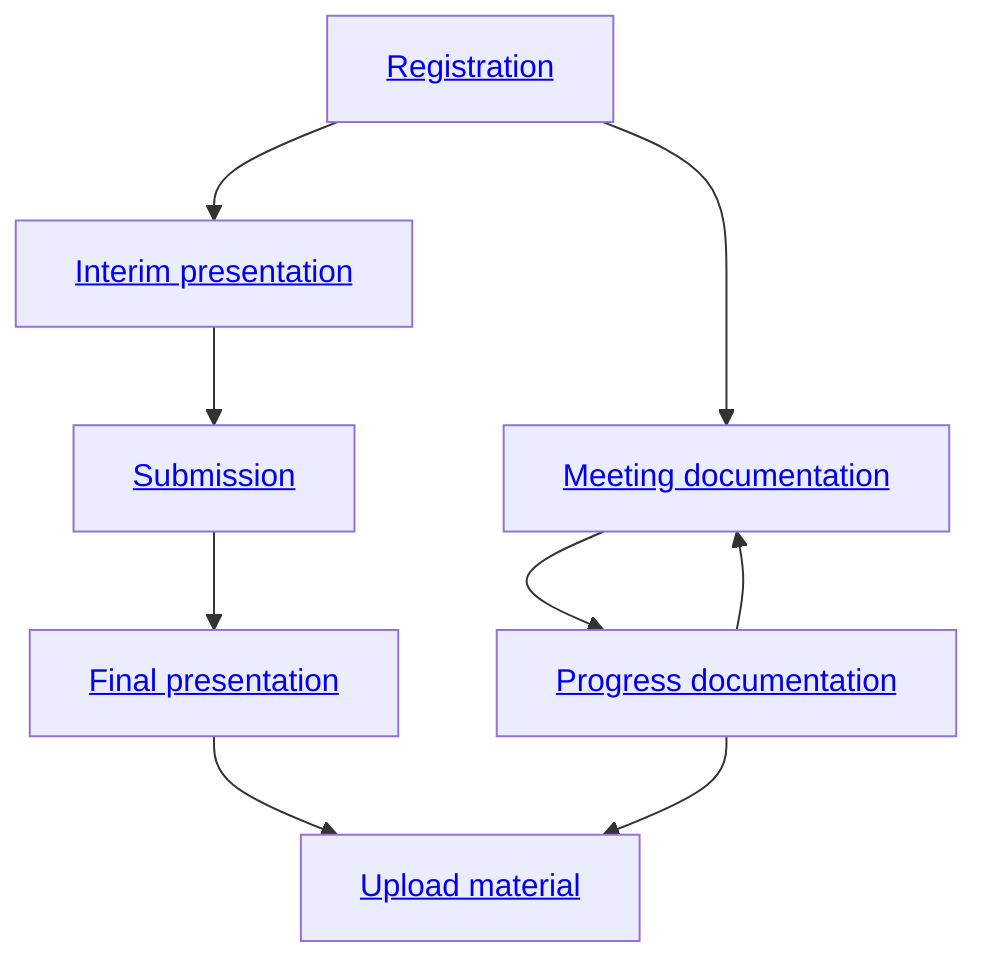

# PROJECT DESCRIPTION

[Title] Local Iterative Optimization for Graph Bundling

[Short abstract]
_In this project, we want to use a polycephalum algorithm to approximate a minimal Steiner tree to bundle graphs._

[Type of Project] Bachelor thesis

- Project start date: 20.10.2022
- Project due date: 20.02.2022

<details><summary>Supervisors</summary>

- Project Owner: Jan Straub
- Supervisor: Filip Sadlo
- Assistant: Maksim Schreck

</details>


# Organisational Issues

## Status


- [x] Registrated (20.10.2022)
- [ ] Work submitted (DD.MM.YYYY)
- [ ] Final presentation done (DD.MM.YYYY) 
- [ ] Uploaded all materials (DD.MM.YYYY) 

# PROJECT PLAN

## Procedure



## Minutes of Meeting

Minutes of meeting are a very important management tool in order to give meetings structure.They provide the following benefits:

* **Structure**: They  provide  every  meeting  with  structure  and  time  itself  is  organized  in  astructured way. Minutes are organized into three parts: (1) topics discussed, (2) progress since the previous meeting, and (3) a todo list of goals for the next meeting.
* **Continuity and Memory**: Minutes provide continuity over time. Each meeting starts out by reviewing the previous minutes of meeting. This helps attendants remember precisely what topics where discussed at the last meeting. People tend to forget what was discussed at the last meeting because they have so many other things going on.
* **Aid in Progress**: Since each minutes has a todo list of goals before the next meeting, the progress of every project can be monitored in structured fashion. Also, larger tasks that may require months (or years) of work are broken down into smaller units of time which are much more manageable. Attendants at meetings are more-or-less forced to decide what can be done between the current and next meetings.

Minutes should contain the following information:
1. the date of the meeting, its starting time, and the ending time,
2. the name of each person present at the meeting,
3. a list of topics that were discussed at the meeting,
4. a list of progress, i.e., the things that were accomplished (and not accomplished) since the last meeting,
5. a todo list, i.e., a list of things that are to be worked on prior to the next meeting,
6. the date and time of the next meeting.

This is based on Bob Laramee's [PhD in Visualization Starter Kit](https://cs.swan.ac.uk/~csbob/research/starterKit/). A video presentation can be found [here](https://www.youtube.com/watch?v=BAKQaB-8qko&list=PLZo40sVmw_4MP_CoR5jrC-XZggCOQMdhk&index=3).

## Writing the Protocol

A template protocol can be found in [template.md](../../raw/master/template.md). **Within 3 hours** after each meeting, write up the protocol based on your (possibly handwritten) notes. The protocol should be named `YYYY-MM-DD.md` (e.g, on January 21, 2020, the file would be named `2020-01-21.md`) and commited to this repository. A new file can be added through the web-interface [here](../../new/master/).

## Example Protocol

File `2020-01-21.md`
```markdown
# 2020-01-21: Bob, Malim, Andy

* start time: 13:30
* end time: 15:00
* next meeting: 2020-01-28, 13:30

## Topics discussed

* structure of initial 3rd year project document
* presentation of 3rd year project
* timeline of 3rd year projec

## Progress since last meeting

* Bob: 3rd project plan refined
* Malim: initial document started
* Andy: entry clearance to linux lab authorized

## TODO for next meeting

* Malim: place a copy of the minutes on the CSweb server in a folder called ‘‘minutes’’(w/in 3 hrs)
* Malim: work on title page title page: title, author, current date
* Malim: include table of contents
* Bob: place copy of project guidelines on CS webserver on teaching web page
* Andy: call Sally and ask her if she would like tojoin us at the next meeting

```
